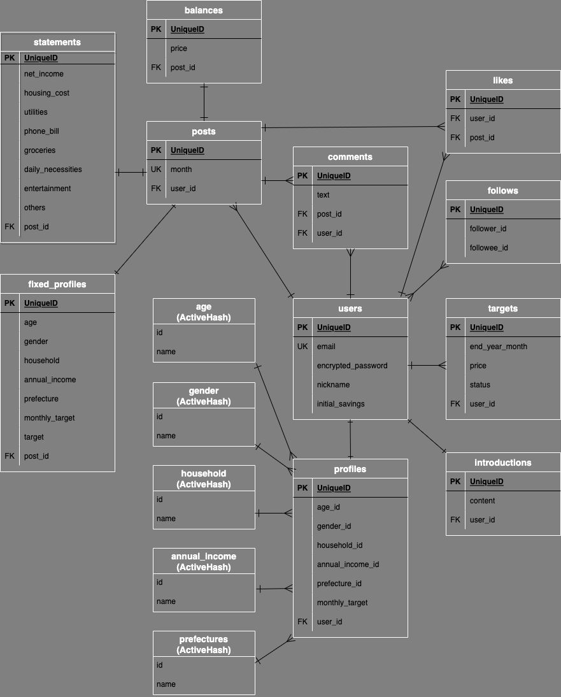
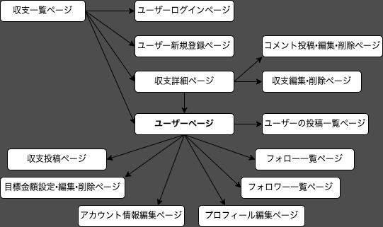

# アプリケーション名
<strong>PILING UP</strong>
  

# アプリケーション概要
毎月の収支の公開や貯金の目標金額の設定ができ、ユーザー同士で収支を参考にし合うことができる。
  

# URL
https://piling-up.herokuapp.com/
  

# テスト用アカウント
### Basic認証
* ID: jun130
* パスワード: 38355
### アカウント1
* メールアドレス: test@test.com
* パスワード: 12345a
### アカウント2
* メールアドレス: samplet@sample.com
* パスワード: 12345a
  

# 利用方法
### 収支投稿
1. ヘッダーからユーザー新規登録を行う
2. ユーザー登録後の遷移先ページでプロフィール情報を登録する
3. マイページのヘッダーから、収支投稿ページで収支(*)を入力し投稿する 
   ( *収支：年月、手取り、住宅費、水道光熱費、通信費、食費、日用品費、娯楽費、その他出費)
4. 収支投稿後、遷移先ページで補足説明を投稿できる (例：その他出費の内訳など)
  
### 目標の設定
1. マイページの「目標金額を設定・編集」から、目標期限と目標金額を入力し設定できる (デフォルトで「未達成」になる)
2. 毎月の収支差で貯金が積み立てられていき、目標金額を超えると「達成」に変更される
  
### 他者を参考にする
1. マイページの「自己紹介を登録」から、タイトルと内容を二つずつ登録できる (例：日々のやり取りで工夫していることなど)
2. 収支詳細ページやユーザーページで、ユーザーのプロフィールを確認できる
3. 収支へのいいねやユーザーをフォローしたり、コメントでメッセージを送り合うことができる
  

# アプリケーションを作成した背景
初めて一人暮らしをした時の過去の自分がペルソナ。
* 家計簿を付け始めたものの、どのような費目にするか・どのような支出割合が適切か、手探りの状態だった。
* 雑誌やブログを参考にしたが、そういった媒体に家計簿を公開している人は貯金を極めている人が多かった。そのため、もっと普通の人や自分と同じようなプロフィールの人の家計簿も見てみたいと感じた。
* 家計簿を付けるだけで満足してしまい、貯金へのモチベーションが保てない時期があった。

以上から、
1. 気軽に投稿できる
2. ユーザーがどの費目にどの程度使っているのか比べて参考にできる
3. ユーザーのプロフィールを確認できる
4. モチベーションを保つ工夫がある

といった機能を持つアプリを開発することにした。
  

# 洗い出した要件
[要件を定義したシート](https://docs.google.com/spreadsheets/d/1NTQiaITko4Jr8C9RD0_LEVGF9SPnwetnzbJAGwjtnc0/edit#gid=982722306)
  

# 実装した機能についての画像やGIFおよびその説明
* ユーザー管理機能 (新規登録・ログイン)
* プロフィール情報の登録・編集
* 自己紹介の登録・編集・削除
* ひと月分の収支の投稿・編集・削除
* 月の目標金額と達成/未達成の表示
* 目標金額の設定と達成度の表示
* 積立貯金額の表示
* コメントの投稿
* いいね機能 (いいねする・外す・一覧)
* フォロー機能 (フォローする・外す・一覧)
  

# 実装予定の機能
* コメントの編集・削除
* コメントへの返信
* 目標金額の編集
* 収支検索機能
* いいね、フォロー、コメント投稿の非同期通信
  

# データベース設計

  

# 画面遷移図

  

# 開発環境
## バックエンド
Ruby, Ruby on Rails
## フロントエンド
HTML, CSS, JavaScript
## データベース
MySQL, SequelPro
## ソース管理
GitHub, GitHubDesktop
## テスト
RSpec
## エディタ
VSCode
  

# ローカルでの動作環境
以下のコマンドを順に実行  
% git clone https://github.com/Jun-130/piling-up.git  
% cd piling-up
% bundle install
% yarn install
  

# 工夫したポイント
* 収支を比較しやすくするため、費目をあえて固定にした。
* ユーザーのプロフィールが将来的に変更されても、収支に紐づくプロフィールは投稿時点のものから変更されないようにした。
* 目標金額について、未達成←→達成の状況が自動で更新されるようにした。
