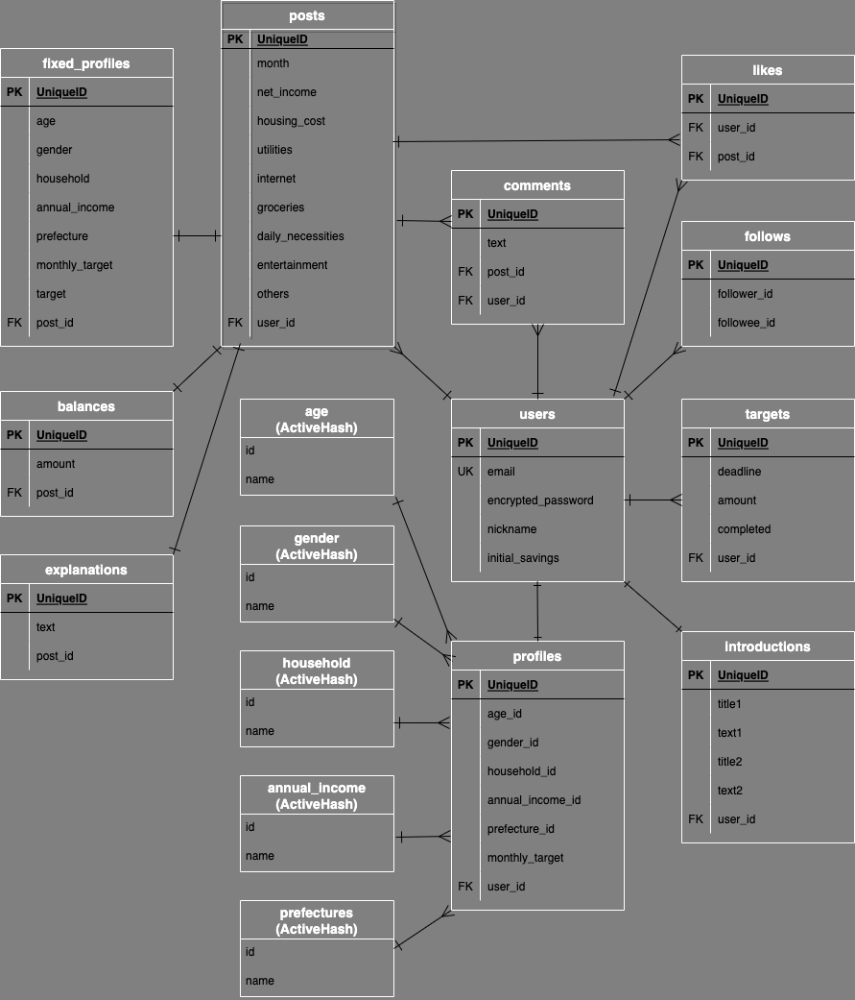

# アプリケーション名
PILING UP
  

# アプリケーション概要
毎月の収支の公開や貯金の目標金額の設定ができ、ユーザー同士で収支を参考にし合うことができる。
  

# URL
http://
  

# テスト用アカウント
### Basic認証
* ID: jun130
* パスワード: 38355
### アカウント1
* メールアドレス: test@test.com
* パスワード: 12345a
### アカウント2
* メールアドレス: samplet@sample.com
* パスワード: 12345a
  

# 利用方法
## 収支投稿
## 目標の設定
## 他者とのコミュニケーション
  

# アプリケーションを作成した背景
初めて一人暮らしをした時の過去の自分がペルソナ。  
* 家計簿を付け始めたものの、どのような費目にするか・どのような支出割合が適切か、手探りの状態だった。  
* 雑誌やブログを参考にしたが、そういった媒体に家計簿を公開している人は貯金を極めている人が多いため、もっと普通の人や自分と同じようなプロフィールの人の家計簿も見てみたいと感じた。  
* 家計簿を付けるだけで満足してしまい貯金へのモチベーションが保てない時期があった。  

以上から、  
1. 気軽に投稿できる
2. ユーザーがどの費目にどの程度使っているのか比べて参考にできる
3. ユーザーのプロフィールを確認できる
4. モチベーションを保つ工夫がある

といった機能を持つアプリを開発することにした。
  

# 洗い出した要件
[要件を定義したシート](https://docs.google.com/spreadsheets/d/1NTQiaITko4Jr8C9RD0_LEVGF9SPnwetnzbJAGwjtnc0/edit#gid=982722306)
  

# 実装した機能についての画像やGIFおよびその説明
* ユーザー登録
* プロフィール情報の登録・編集
* 自己紹介の登録・編集・削除
* ひと月分の収支の投稿・編集・削除
* 目標金額の設定・編集
* コメントの投稿
* いいね機能
* フォロー機能
  

# 実装予定の機能
* コメントの編集・削除
* コメントへの返信
* プロフィールでの収支検索機能
* いいね、フォローの非同期通信
  

# データベース設計

  

# 画面遷移図

  

# 開発環境
- フロントエンド
- バックエンド
- インフラ
- テスト
- テキストエディタ
  

# ローカルでの動作環境
以下のコマンドを順に実行  
% git clone https://github.com/xxxxxx  
% cd piling-up  
% bundle install  
% yarn install  
  

# 工夫したポイント
* 収支を比較しやすくするため、費目をあえて固定にした。
* ユーザーのプロフィールが将来的に変更されても、収支に紐づくプロフィールは投稿時点のものから変更されないようにした。
* 目標金額について、未達成←→達成の状況が自動で更新されるようにした。
